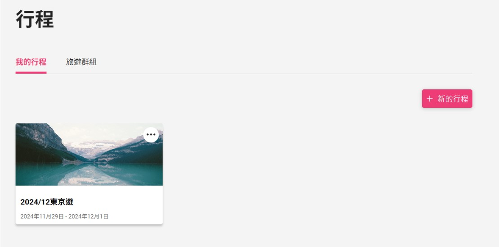
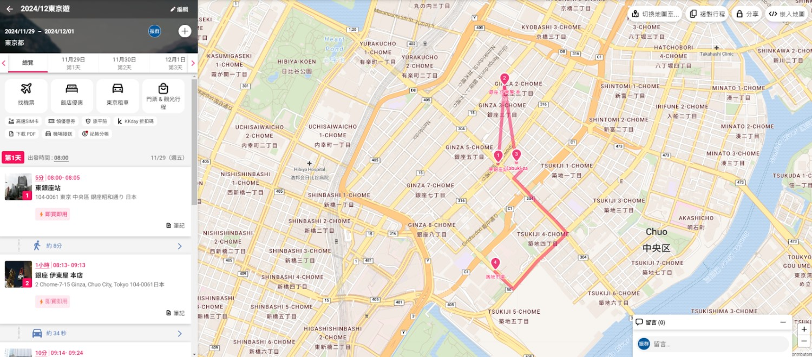
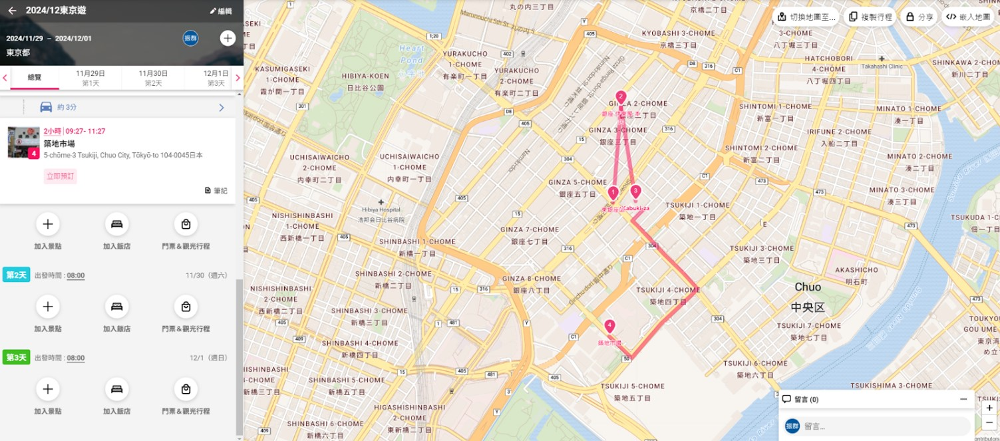
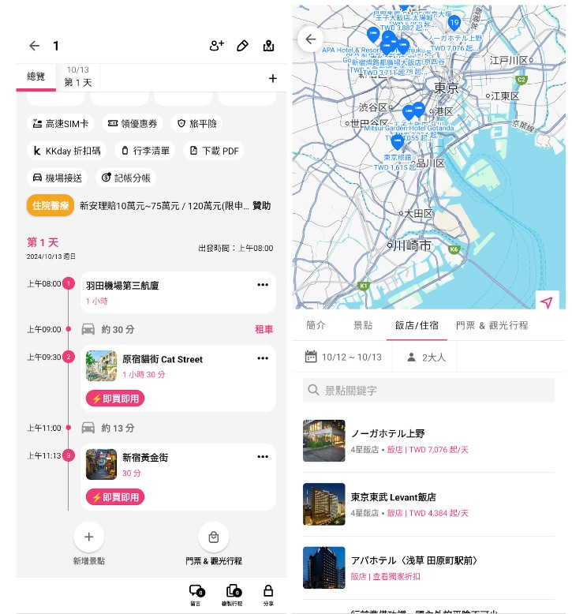

# 老師的回覆: 
- 目前的架構有沒有什麼問題(挑戰性夠不夠)
- 後端有什麼推薦的工具

- 好用的行程規劃介面 (UI) => 前端 UIUX => 復刻 Funliday => 試試看有沒有辦法做一些改進
    - Google API
        - 使用者查過的地點（google map api） => 存起來 （又快又省錢） => 快取
            - 快取過期？ (cache invalidation) => 處理更新？
            - 存資料庫就可以了
            - 更熱門的景點 -> 快取在記憶體 (redis)
- 共編行程 
    - websocket (socket.io) 
    - 進階: race condition => 怎麼解？
- 共享
    - 權限？誰可以看？誰可以改？
- 爬蟲 ->  爬住宿（價格變化、空房？）、交通 (各國交通都不一樣？)

- EC2 instance (web srv, websocket, react), S3 (也許再搭配 CDN (CloudFront)), RDS (postgresql),

- (X)流量

# 小組討論: 

- 題目
- 核心功能、次要功能、其他功能
    - 行程規劃 (核心功能)  → 參考 Funliday ([LINK](https://www.funliday.com/tw))
    - 住房、交通訂票 → 跳到專門的訂票網站
    - 分享行程
    - 旅遊影音分享
    - 分帳功能

- 介面: 
    - 我的帳號 (登出登入)
    - 我的行程 (新增行程/歷史記錄)
    - 旅遊分享 (暫無討論)
 
 

- 行程規劃: (使用過程可多個帳號共同編輯)
 → 建立行程 (輸入 行程名稱 / 目的地 / 出發日期 / 新增共編帳號)
 → 總覽頁面逐天加入資料
 → 點地圖上景點或文字搜尋景點 (地圖上顯示 + 清單顯示)
 → 加入行程
 → 地圖更新行程路徑, 下方更新當日行程
 → 點搜尋飯店 (地圖上顯示 + 清單顯示 + 標註價位, 可跳到訂房網站)
 
 
 

- 搜尋功能整理: 
    - 上方地圖圖標 (顯示當前區域內景點, 可直接點擊圖標)
    - 下方清單式搜尋
    - 可選景點搜尋或飯店搜尋
    - 選擇目標後
    - 加入行程 (輸入 停留時間 / 備註 / 新增花費(分帳功能)) 
    - 導航 (跳至 google map app 的路線規劃)
    - 訂房 (搜尋飯店才有, 跳至訂房網站)
 
 

- 其他備註: 
    - 可直接拖曳改變景點順序

- 技術
    - 前端?  (JS (React, Vue 或不用框架？), CSS)
        - next.js(可同時做前後端)
    - 後端?  (後端程式語言、版本、框架、工具、資料庫)
        - express
        - API (AWS、Google Map)
        - 共編
            - 只要其他使用者有更新，伺服器端就會把更新，透過 WebSocket 的接口，傳送給其他的客戶端 => race condition
                - lock?
                - 實作演算法，讓所有人都可以同時共編
        - 住房、交通訂票
            - 爬蟲
        - 資料庫  (使用 PostgreSQL 和 AWS RDS) (暫時先只考慮核心功能)
            - 關聯性資料庫： => table schema 
            - 使用者帳號：記錄使用者ID
            - 行程：名稱、目的地、開始日期、共編帳號
            - 每日行程：當日所有景點、備註
            - 所有景點：景點名稱、位置、類型

- 核心功能架構圖 ([目前架構](https://app.eraser.io/workspace/Cp7kn6PmNW3jZoLf93oS))
    - (圖片待補充)

- 框線圖範例 (功能、大略UI)
    - (圖片待補充)
	
- 團隊合作
    - Branching Model: Git
    - 如何用 Trello 專案管理: 三個區塊 (ToDo、Doing、Done)

