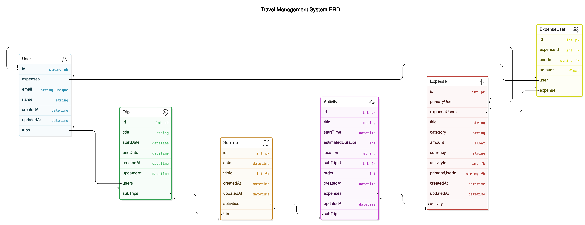
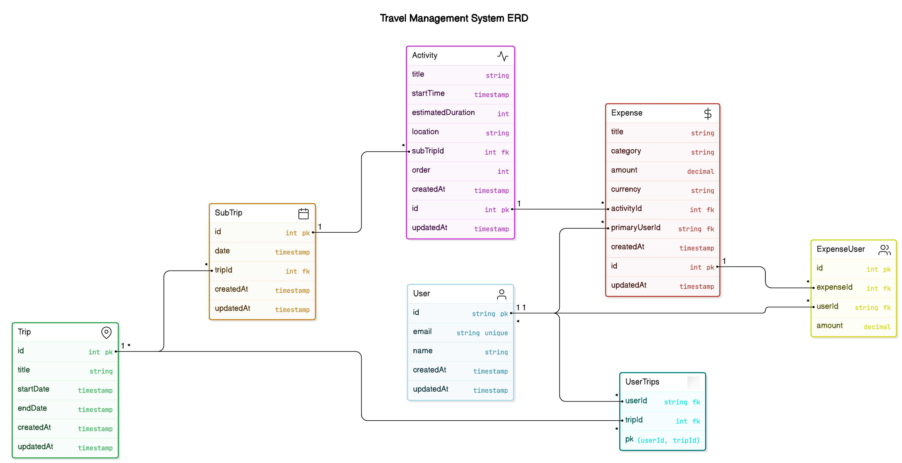

# Schemas

以下是 schemas 的草稿

1. Prisma Models
```
model User {
  id        String       @id @default(cuid())  // 使用 cuid 作為 ID
  email     String       @unique
  name      String?
  trips     Trip[]       @relation("UserTrips")
  expenses  ExpenseUser[] // 與 ExpenseUser 的關聯，用於多位使用者分攤
  createdAt DateTime     @default(now())
  updatedAt DateTime     @updatedAt
}

model Trip {
  id         Int         @id @default(autoincrement())
  title      String
  users      User[]      @relation("UserTrips")
  subTrips   SubTrip[]
  startDate  DateTime?
  endDate    DateTime?
  editableList String    // 可編輯的userId陣列, PostgreSQL中好像有INTEGER[]可以用?  *新增
  ViewableList String    // 可查看的userId陣列  *新增
  createdAt  DateTime    @default(now())
  updatedAt  DateTime    @updatedAt
}

model SubTrip {
  id         Int         @id @default(autoincrement())
  date       DateTime
  trip       Trip        @relation(fields: [tripId], references: [id])
  tripId     Int
  activities Activity[]
  createdAt  DateTime    @default(now())
  updatedAt  DateTime    @updatedAt
}

model Activity {
  id               Int        @id @default(autoincrement())
  title            String
  startTime        DateTime?
  estimatedDuration Int       // 預估時間 (以分鐘為單位)
  attraction       Attractions @relation(fields: [attractionId], references: [id]) // *新增
  attractionId     Int        // location改成抓景點資料庫的id  *新增
  subTrip          SubTrip    @relation(fields: [subTripId], references: [id])
  subTripId        Int
  note             String     // 每個活動的備註  *新增
  expenses         Expense[]  // 與多筆 Expense 的關聯
  order            Int
  createdAt        DateTime   @default(now())
  updatedAt        DateTime   @updatedAt
}

model Attractions {  // 景點資料庫  *新增
  id         Int         @id @default(autoincrement())
  name       String
  location   point       // 經緯度
  image      String      // 存景點圖片的連結  (是說PostgreSQL好像沒有String?)
  rating     Float       // 平均評分
  createdAt  DateTime    @default(now())
  updatedAt  DateTime    @updatedAt
}

model Expense {
  id               Int           @id @default(autoincrement())
  title            String        // 花費標題
  category         String        // 花費分類
  amount           Float         // 總花費金額
  currency         String        // 幣別
  activity         Activity      @relation(fields: [activityId], references: [id])
  activityId       Int
  primaryUser      User          @relation(fields: [primaryUserId], references: [id]) // 主要付款人
  primaryUserId    String
  expenseUsers     ExpenseUser[] // 與多位分攤使用者的關聯
  createdAt        DateTime      @default(now())
  updatedAt        DateTime      @updatedAt
}

model ExpenseUser {
  id              Int     @id @default(autoincrement())
  expense         Expense @relation(fields: [expenseId], references: [id])
  expenseId       Int
  user            User    @relation(fields: [userId], references: [id])
  userId          String
  amount          Float   // 該使用者分攤的金額
}

model Comments {  // 留言區  *新增
  id              Int           @id @default(autoincrement())
  trip            Trip          @relation(fields: [tripId], references: [id])
  tripId          Int           // 對應的行程表
  user            User          @relation(fields: [userId], references: [id])
  userId          String        // 對應的user
  content         String        // 該留言內容
  createdAt       DateTime      @default(now())
  updatedAt       DateTime      @updatedAt
}
```

註: 大致看起來應該是蠻完整的了，但感覺要有一個使用者正在編輯畫面的boolean，來判斷其他人當下可不可以編輯，但目前不太確定擺在哪裡會比較好，可以先不加 ，之後討論。

1.1 prisma schema
<br>

1.2 raw SQL schema
<br>
