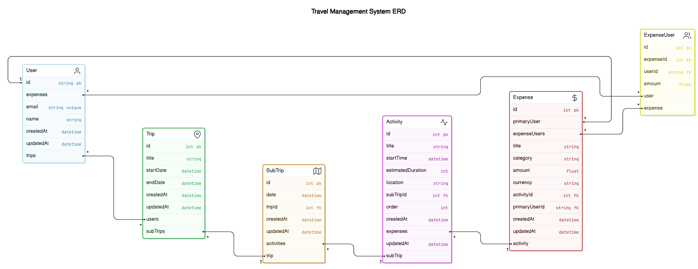

# Schemas

以下是 schemas 的草稿

1. Prisma Models
```
model User {
  id        String       @id @default(cuid())  // 使用 cuid 作為 ID
  email     String       @unique
  name      String?
  trips     Trip[]       @relation("UserTrips")
  expenses  ExpenseUser[] // 與 ExpenseUser 的關聯，用於多位使用者分攤
  createdAt DateTime     @default(now())
  updatedAt DateTime     @updatedAt
}

model Trip {
  id         Int         @id @default(autoincrement())
  title      String
  users      User[]      @relation("UserTrips")
  subTrips   SubTrip[]
  startDate  DateTime?
  endDate    DateTime?
  editableList String    // 可編輯的userId陣列, PostgreSQL中好像有INTEGER[]可以用?  *新增
  ViewableList String    // 可查看的userId陣列  *新增
  createdAt  DateTime    @default(now())
  updatedAt  DateTime    @updatedAt
}

model SubTrip {
  id         Int         @id @default(autoincrement())
  date       DateTime
  trip       Trip        @relation(fields: [tripId], references: [id])
  tripId     Int
  activities Activity[]
  createdAt  DateTime    @default(now())
  updatedAt  DateTime    @updatedAt
}

model Activity {
  id               Int        @id @default(autoincrement())
  title            String
  startTime        DateTime?
  estimatedDuration Int       // 預估時間 (以分鐘為單位)
  attraction       Attractions @relation(fields: [attractionId], references: [id]) // *新增
  attractionId     Int        // location改成抓景點資料庫的id  *新增
  subTrip          SubTrip    @relation(fields: [subTripId], references: [id])
  subTripId        Int
  note             String     // 每個活動的備註  *新增
  expenses         Expense[]  // 與多筆 Expense 的關聯
  order            Int
  createdAt        DateTime   @default(now())
  updatedAt        DateTime   @updatedAt
}

model Attractions {  // 景點資料庫  *新增
  id         Int         @id @default(autoincrement())
  name       String
  location   point       // 經緯度
  image      String      // 存景點圖片的連結  (是說PostgreSQL好像沒有String?)
  rating     Float       // 平均評分
  createdAt  DateTime    @default(now())
  updatedAt  DateTime    @updatedAt
}

model Expense {
  id               Int           @id @default(autoincrement())
  title            String        // 花費標題
  category         String        // 花費分類
  amount           Float         // 總花費金額
  currency         String        // 幣別
  activity         Activity      @relation(fields: [activityId], references: [id])
  activityId       Int
  primaryUser      User          @relation(fields: [primaryUserId], references: [id]) // 主要付款人
  primaryUserId    String
  expenseUsers     ExpenseUser[] // 與多位分攤使用者的關聯
  createdAt        DateTime      @default(now())
  updatedAt        DateTime      @updatedAt
}

model ExpenseUser {
  id              Int     @id @default(autoincrement())
  expense         Expense @relation(fields: [expenseId], references: [id])
  expenseId       Int
  user            User    @relation(fields: [userId], references: [id])
  userId          String
  amount          Float   // 該使用者分攤的金額
}

model Comments {  // 留言區  *新增
  id              Int           @id @default(autoincrement())
  trip            Trip          @relation(fields: [tripId], references: [id])
  tripId          Int           // 對應的行程表
  user            User          @relation(fields: [userId], references: [id])
  userId          String        // 對應的user
  content         String        // 該留言內容
  createdAt       DateTime      @default(now())
  updatedAt       DateTime      @updatedAt
}
```

註: 大致看起來應該是蠻完整的了，但感覺要有一個使用者正在編輯畫面的boolean，來判斷其他人當下可不可以編輯，但目前不太確定擺在哪裡會比較好，可以先不加 ，之後討論。

1.1 prisma schema
<br>

1.2 raw SQL schema
<br>


# API
以下是 api endpoints 的草稿，細節到時候再說
有少 api endpoints 再說一聲
先讓他跑起來，再做redis(cache layer)
共編的項目有啥？卡片順序，文字

2. Create Trip
```javascript
import { z } from 'zod';

const createTripSchema = z.object({
  title: z.string(),
  userId: z.string(),  // user creating the trip
});

router.post('/api/trips', async (req, res) => {
  const parseResult = createTripSchema.safeParse(req.body);
  if (!parseResult.success) {
    return res.status(400).json({ error: parseResult.error.errors });
  }

  const { title, userId } = parseResult.data;

  try {
    const trip = await prisma.trip.create({
      data: {
        title,
        users: { connect: { id: userId } },
      },
    });
    res.status(201).json(trip);
  } catch (error) {
    res.status(500).json({ error: 'Failed to create trip' });
  }
});
```
The response looks like
```json
{
  "id": "trip_123",
  "title": "Summer Vacation 2024",
  "createdAt": "2024-10-30T10:15:30.000Z",
  "updatedAt": "2024-10-30T10:15:30.000Z",
  "users": [
    {
      "id": "user_456",
      "name": "John Doe",
      "email": "johndoe@example.com"
    }
  ]
}
```

3. Delete Trip
```javascript
import { z } from 'zod';

const deleteTripSchema = z.object({
  tripId: z.string(),
});

router.delete('/api/trips/:tripId', async (req, res) => {
  const parseResult = deleteTripSchema.safeParse({ tripId: req.params.tripId });
  if (!parseResult.success) {
    return res.status(400).json({ error: parseResult.error.errors });
  }

  const { tripId } = parseResult.data;

  try {
    await prisma.trip.delete({
      where: { id: Number(tripId) },
    });
    res.status(204).send();
  } catch (error) {
    res.status(500).json({ error: 'Failed to delete trip' });
  }
});
```

4. Create SubTrip
```javascript
const createSubTripSchema = z.object({
  tripId: z.string(),
  date: z.string().datetime(),  // assuming ISO date format
});

router.post('/api/trips/:tripId/subtrips', async (req, res) => {
  const parseResult = createSubTripSchema.safeParse({
    tripId: req.params.tripId,
    ...req.body,
  });
  if (!parseResult.success) {
    return res.status(400).json({ error: parseResult.error.errors });
  }

  const { tripId, date } = parseResult.data;

  try {
    const subTrip = await prisma.subTrip.create({
      data: {
        date,
        trip: { connect: { id: Number(tripId) } },
      },
    });
    res.status(201).json(subTrip);
  } catch (error) {
    res.status(500).json({ error: 'Failed to create subtrip' });
  }
});
```

5. Delete SubTrip
```javascript
const deleteSubTripSchema = z.object({
  subTripId: z.string(),
});

router.delete('/api/subtrips/:subTripId', async (req, res) => {
  const parseResult = deleteSubTripSchema.safeParse({ subTripId: req.params.subTripId });
  if (!parseResult.success) {
    return res.status(400).json({ error: parseResult.error.errors });
  }

  const { subTripId } = parseResult.data;

  try {
    await prisma.subTrip.delete({
      where: { id: Number(subTripId) },
    });
    res.status(204).send();
  } catch (error) {
    res.status(500).json({ error: 'Failed to delete subtrip' });
  }
});
```

6. Create Activity
```javascript
const createActivitySchema = z.object({
  subTripId: z.string(),
  title: z.string(),
  startTime: z.string().datetime(),
  estimatedDuration: z.number(),
  location: z.string().optional(),
  order: z.number().optional(),
});

router.post('/api/subtrips/:subTripId/activities', async (req, res) => {
  const parseResult = createActivitySchema.safeParse({
    subTripId: req.params.subTripId,
    ...req.body,
  });
  if (!parseResult.success) {
    return res.status(400).json({ error: parseResult.error.errors });
  }

  const { subTripId, title, startTime, estimatedDuration, location, order } = parseResult.data;

  try {
    const activity = await prisma.activity.create({
      data: {
        title,
        startTime,
        estimatedDuration,
        location,
        order,
        subTrip: { connect: { id: Number(subTripId) } },
      },
    });
    res.status(201).json(activity);
  } catch (error) {
    res.status(500).json({ error: 'Failed to create activity' });
  }
});
```

7. Delete Activity
```javascript
const deleteActivitySchema = z.object({
  activityId: z.string(),
});

router.delete('/api/activities/:activityId', async (req, res) => {
  const parseResult = deleteActivitySchema.safeParse({ activityId: req.params.activityId });
  if (!parseResult.success) {
    return res.status(400).json({ error: parseResult.error.errors });
  }

  const { activityId } = parseResult.data;

  try {
    await prisma.activity.delete({
      where: { id: Number(activityId) },
    });
    res.status(204).send();
  } catch (error) {
    res.status(500).json({ error: 'Failed to delete activity' });
  }
});
```

8. Update Activity startTime or estimatedDuration
```javascript
const updateActivitySchema = z.object({
  activityId: z.string(),
  startTime: z.string().datetime().optional(),
  estimatedDuration: z.number().optional(),
});

router.patch('/api/activities/:activityId', async (req, res) => {
  const parseResult = updateActivitySchema.safeParse({
    activityId: req.params.activityId,
    ...req.body,
  });
  if (!parseResult.success) {
    return res.status(400).json({ error: parseResult.error.errors });
  }

  const { activityId, startTime, estimatedDuration } = parseResult.data;

  try {
    const activity = await prisma.activity.update({
      where: { id: Number(activityId) },
      data: {
        ...(startTime ? { startTime } : {}),
        ...(estimatedDuration ? { estimatedDuration } : {}),
      },
    });
    res.status(200).json(activity);
  } catch (error) {
    res.status(500).json({ error: 'Failed to update activity' });
  }
});
```

9. Update Activity Order
```javascript
const updateActivityOrderSchema = z.object({
  activityId: z.string(),
  order: z.number(),
});

router.patch('/api/activities/:activityId/order', async (req, res) => {
  const parseResult = updateActivityOrderSchema.safeParse({
    activityId: req.params.activityId,
    ...req.body,
  });
  if (!parseResult.success) {
    return res.status(400).json({ error: parseResult.error.errors });
  }

  const { activityId, order } = parseResult.data;

  try {
    const activity = await prisma.activity.update({
      where: { id: Number(activityId) },
      data: { order },
    });
    res.status(200).json(activity);
  } catch (error) {
    res.status(500).json({ error: 'Failed to update activity order' });
  }
});
```

10. Get All Activities Associated with a Trip
```javascript
const getActivitiesByTripSchema = z.object({
  tripId: z.string(),
});

router.get('/api/trips/:tripId/activities', async (req, res) => {
  const parseResult = getActivitiesByTripSchema.safeParse({ tripId: req.params.tripId });
  if (!parseResult.success) {
    return res.status(400).json({ error: parseResult.error.errors });
  }

  const { tripId } = parseResult.data;

  try {
    const activities = await prisma.activity.findMany({
      where: {
        subTrip: {
          tripId: Number(tripId),
        },
      },
    });
    res.status(200).json(activities);
  } catch (error) {
    res.status(500).json({ error: 'Failed to retrieve activities for trip' });
  }
});
```

11. Get All Activities Associated with a SubTrip
```javascript
const getActivitiesBySubTripSchema = z.object({
  subTripId: z.string(),
});

router.get('/api/subtrips/:subTripId/activities', async (req, res) => {
  const parseResult = getActivitiesBySubTripSchema.safeParse({ subTripId: req.params.subTripId });
  if (!parseResult.success) {
    return res.status(400).json({ error: parseResult.error.errors });
  }

  const { subTripId } = parseResult.data;

  try {
    const activities = await prisma.activity.findMany({
      where: {
        subTripId: Number(subTripId),
      },
    });
    res.status(200).json(activities);
  } catch (error) {
    res.status(500).json({ error: 'Failed to retrieve activities for subtrip' });
  }
});
```

12. Create Expense Associated with Activity
```javascript
const createExpenseSchema = z.object({
  activityId: z.string(),
  title: z.string(),
  category: z.string(),
  amount: z.number(),
  currency: z.string(),
  primaryUserId: z.string(),
  expenseUsers: z.array(
    z.object({
      userId: z.string(),
      amount: z.number(),
    })
  ),
});

router.post('/api/activities/:activityId/expenses', async (req, res) => {
  const parseResult = createExpenseSchema.safeParse({
    activityId: req.params.activityId,
    ...req.body,
  });
  if (!parseResult.success) {
    return res.status(400).json({ error: parseResult.error.errors });
  }

  const { activityId, title, category, amount, currency, primaryUserId, expenseUsers } = parseResult.data;

  try {
    const expense = await prisma.expense.create({
      data: {
        title,
        category,
        amount,
        currency,
        primaryUser: { connect: { id: primaryUserId } },
        activity: { connect: { id: Number(activityId) } },
        expenseUsers: {
          create: expenseUsers.map(user => ({
            user: { connect: { id: user.userId } },
            amount: user.amount,
          })),
        },
      },
    });
    res.status(201).json(expense);
  } catch (error) {
    res.status(500).json({ error: 'Failed to create expense' });
  }
});
```

13. Update Expense Associated with Activity
```javascript
const updateExpenseSchema = z.object({
  expenseId: z.string(),
  title: z.string().optional(),
  category: z.string().optional(),
  amount: z.number().optional(),
  currency: z.string().optional(),
});

router.patch('/api/expenses/:expenseId', async (req, res) => {
  const parseResult = updateExpenseSchema.safeParse({
    expenseId: req.params.expenseId,
    ...req.body,
  });
  if (!parseResult.success) {
    return res.status(400).json({ error: parseResult.error.errors });
  }

  const { expenseId, ...updateData } = parseResult.data;

  try {
    const expense = await prisma.expense.update({
      where: { id: Number(expenseId) },
      data: updateData,
    });
    res.status(200).json(expense);
  } catch (error) {
    res.status(500).json({ error: 'Failed to update expense' });
  }
});
```

14. Delete Expense Associated with Activity
```javascript
const deleteExpenseSchema = z.object({
  expenseId: z.string(),
});

router.delete('/api/expenses/:expenseId', async (req, res) => {
  const parseResult = deleteExpenseSchema.safeParse({ expenseId: req.params.expenseId });
  if (!parseResult.success) {
    return res.status(400).json({ error: parseResult.error.errors });
  }

  const { expenseId } = parseResult.data;

  try {
    await prisma.expense.delete({
      where: { id: Number(expenseId) },
    });
    res.status(204).send();
  } catch (error) {
    res.status(500).json({ error: 'Failed to delete expense' });
  }
});
```

15. Get Expenses Associated with Trip
```javascript
const getExpensesByTripSchema = z.object({
  tripId: z.string(),
});

router.get('/api/trips/:tripId/expenses', async (req, res) => {
  const parseResult = getExpensesByTripSchema.safeParse({ tripId: req.params.tripId });
  if (!parseResult.success) {
    return res.status(400).json({ error: parseResult.error.errors });
  }

  const { tripId } = parseResult.data;

  try {
    const expenses = await prisma.expense.findMany({
      where: {
        activity: {
          subTrip: {
            tripId: Number(tripId),
          },
        },
      },
    });
    res.status(200).json(expenses);
  } catch (error) {
    res.status(500).json({ error: 'Failed to retrieve expenses for trip' });
  }
});
```

16. Get Expenses Associated with Trip & Self
```javascript
const getExpensesByTripAndUserSchema = z.object({
  tripId: z.string(),
  userId: z.string(),
});

router.get('/api/trips/:tripId/expenses/self', async (req, res) => {
  const parseResult = getExpensesByTripAndUserSchema.safeParse({
    tripId: req.params.tripId,
    userId: req.query.userId,
  });
  if (!parseResult.success) {
    return res.status(400).json({ error: parseResult.error.errors });
  }

  const { tripId, userId } = parseResult.data;

  try {
    const expenses = await prisma.expense.findMany({
      where: {
        activity: {
          subTrip: {
            tripId: Number(tripId),
          },
        },
        expenseUsers: {
          some: { userId },
        },
      },
    });
    res.status(200).json(expenses);
  } catch (error) {
    res.status(500).json({ error: 'Failed to retrieve expenses for trip and user' });
  }
});
```

